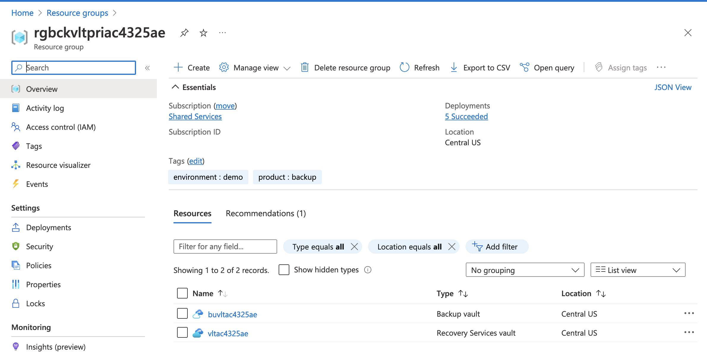
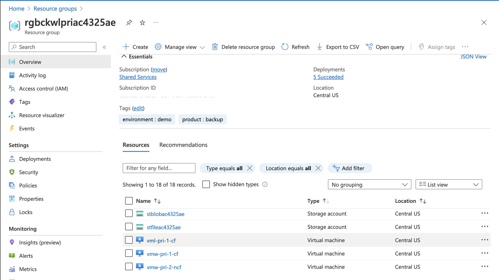
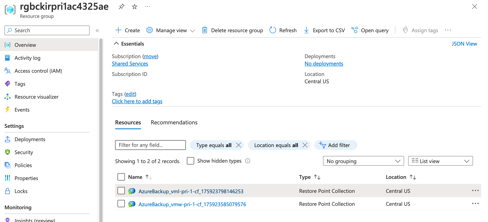

## Exercise 1 - Azure Backup Overview

**NOTE: You should let this lab run for 24 hours before proceeding with these exercises to allow for restore points to be created**

In this exercise you will open the Azure Portal to look at the resources deployed with the lab. You will learn about [Azure Backup Architecture](https://learn.microsoft.com/en-us/azure/backup/backup-architecture) and its resources such as the [Recovery Services Vault](https://docs.microsoft.com/en-us/azure/backup/backup-azure-recovery-services-vault-overview) and [Backup Vault](https://learn.microsoft.com/en-us/azure/backup/backup-vault-overview).

Open the Azure Portal and select the resource group that begins with rgbckvltpri. The resource group contains two resources, a Recovery Services Vault and a Backup Vault.

The [Recovery Services Vault](https://learn.microsoft.com/en-us/azure/backup/backup-azure-recovery-services-vault-overview) is used by the Azure Backup service to store data that is backed up for Azure Virtual Machines, Azure Files, files and folders on a Windows Server using the [MARS (Microsoft Azure Recovery Services) agent](https://learn.microsoft.com/en-us/azure/backup/install-mars-agent), and other resources. It also stores backup policies which control how these items are backup up.

You will notice the Recovery Services Vault has been deployed to the same region as the workload. When used for backup, Recovery Services Vault must be created in the same region and subscription as the workloads that are being backed up.

The [Backup Vault](https://learn.microsoft.com/en-us/azure/backup/backup-vault-overview) is another resource used by the Azure Backup service. Backup Vaults are used to backup blobs in Azure Storage, Managed Disks, and Azure Database for PostgreSQL. It also holds the backup policies which control how the data is backed up. An interesting thing to note about Backup Vaults is that for blobs and managed disks, the data is never transferred to the Backup Vault and the vault is instead used as an orchestration model which activites built-in features of the services such as blob point-in-time restore or the snapshot capability of managed disks.

Unlike Recovery Services Vaults, Backup Vaults do not need to be within the same subscription as the workloads that are being backed up when backing up Managed Disks or blobs.

Select the resource group that begins with rgasrwlpri. This resource group is used to hold the resources that represent the workload in its normal state.

The resource group contains three virtual machines. The VM named vmw-pri-1-cf is a Windows Server that has been configured for backup. The VM named vml-pri-1-cf is a Linux server that has been configured for backup. The third VM named vmw-pri-2-ncf is not yet configured for backup and will be used in a later exercise.

An Azure Bastion instance is provided to allow for remote access to the VMs in both the primary region and VMs failed over to the secondary region.

The Log Analytics Workspace is used to capture Recovery Services logs and metrics. The vault has been configured to send its diagnostics data to the workspace.

Select the resource group that begins with rgbackirpri1. This resource group contains the restore point collections. 

[Restore point collections include one or more restore points](https://learn.microsoft.com/en-us/azure/virtual-machines/virtual-machines-create-restore-points) which are resources that contain the virtual machine configuration and snapshots of the attached managed disks. Snapshots can be [application-consistent or file-consistent](https://learn.microsoft.com/en-us/azure/backup/backup-azure-vms-introduction#snapshot-consistency). A single restore point collection can include multiple restore points which the retention is maintained through the backup policy.

*Take note that the lab environment needs to be left running for a period of time to generate the restore point collections and restore points.*

When backing up virtual machines with the Azure Backup service, a restore point collection and restore point is first created for the virtual machine. The contents of this restore point are stored in a resource group within the customer's subscription. This is referred to as the opational tier. Once per day, a recovery point is written to the Recovery Services Vault. This is referred to as the standard or vault tier. Restore points can optionally be moved to the [archive tier](https://learn.microsoft.com/en-us/azure/backup/archive-tier-support). This tier [can sometimes result in lower costs](https://learn.microsoft.com/en-us/azure/backup/archive-tier-support#archive-recommendations-only-for-azure-virtual-machines) for storage of the backups. [This video](https://learn.microsoft.com/en-us/azure/backup/archive-tier-support#how-azure-backup-moves-recovery-points-to-the-vault-archive-tier) provides an excellent overview of how restore points traverse storage tiers.

Restore points in the operational tier are used with the [instant restore feature](https://learn.microsoft.com/en-us/azure/backup/backup-instant-restore-capability) which can restore a virtual machine to a prior state in a faster than restoring from a restore point in the standard/vault tier. A backup policy determines how long restore points are retained in the operational tier. The next exercise will explore backup policies.

This completes exercise 1. You can now proceed to [exercise 2](/exercises/exercise2.md).