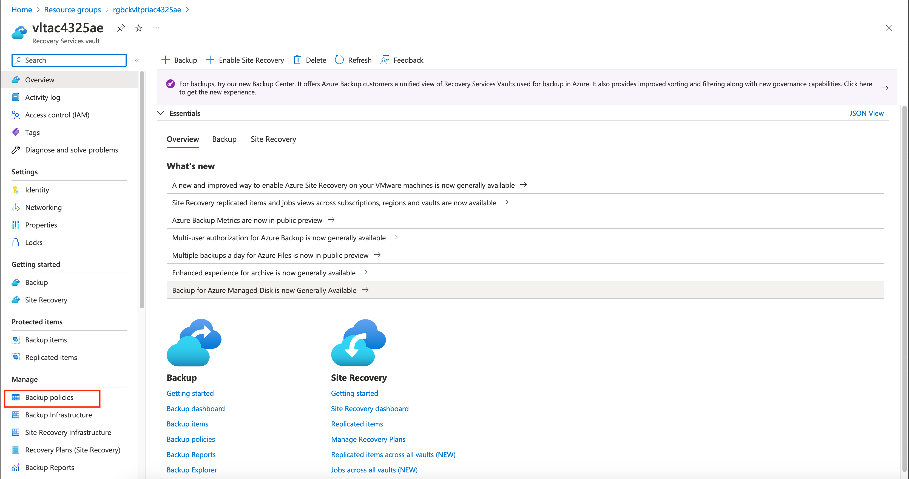
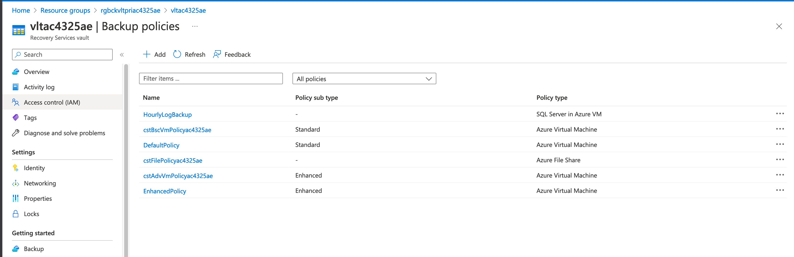
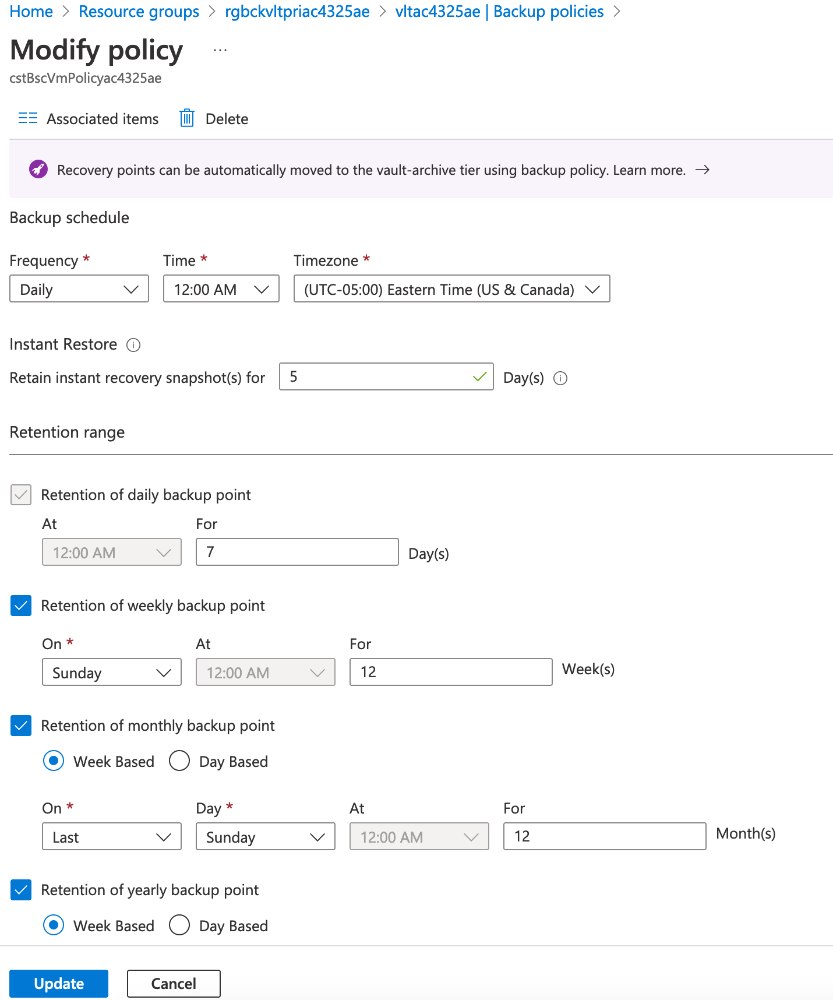
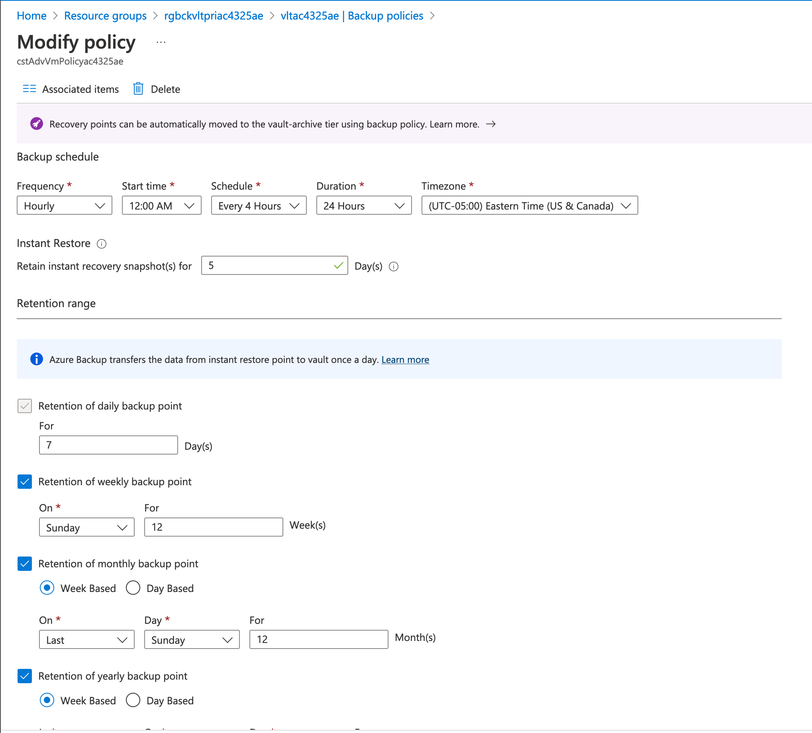
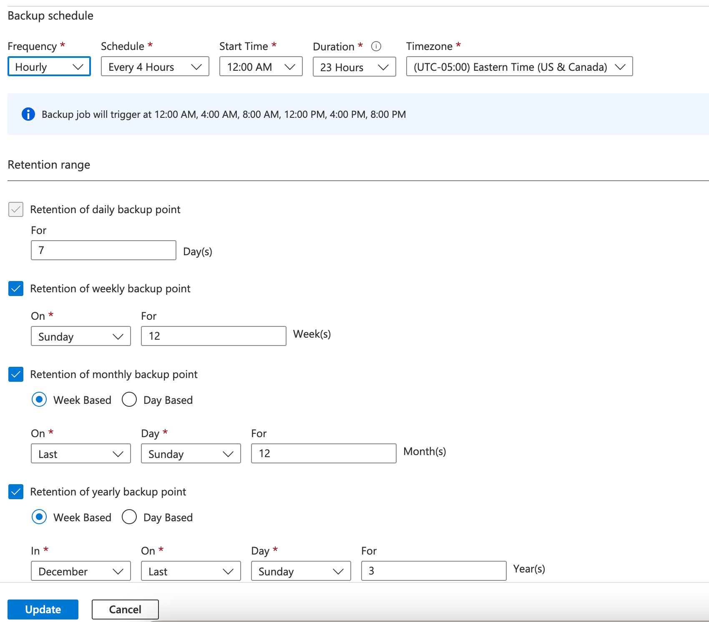
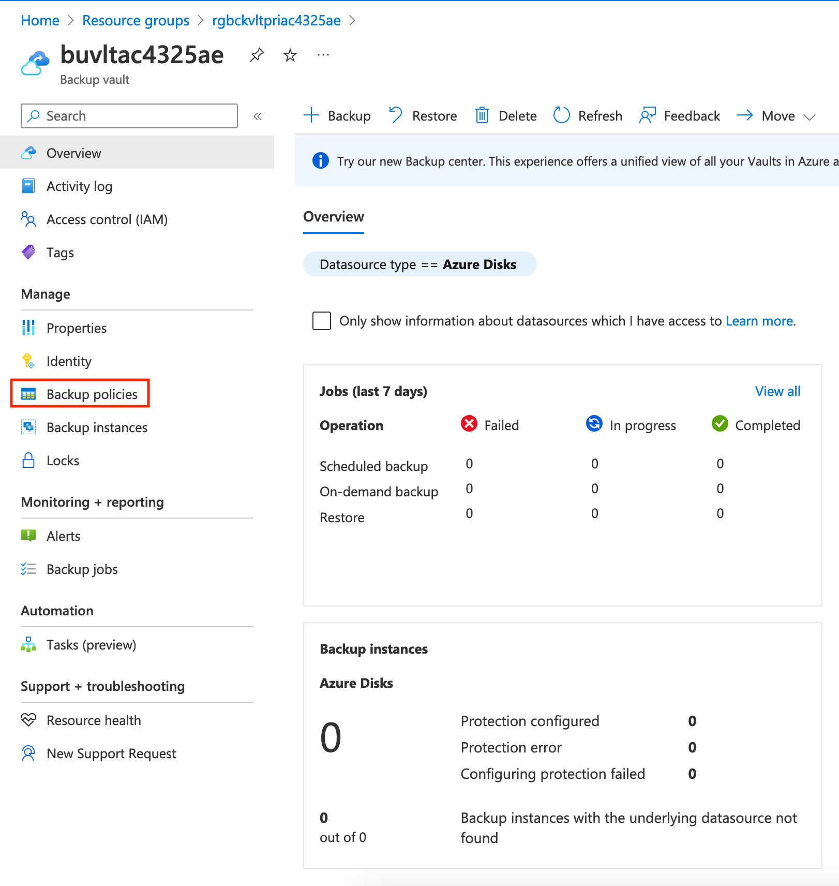
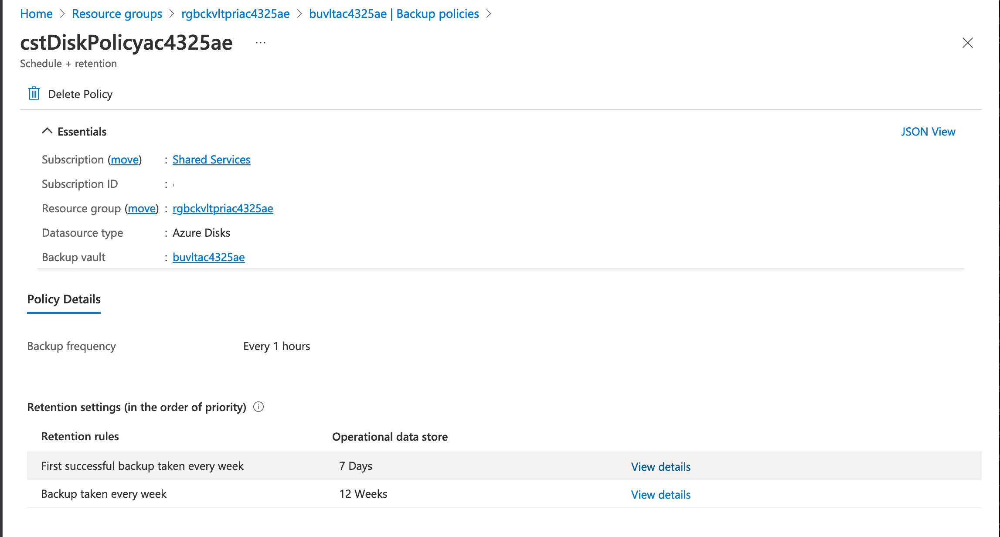
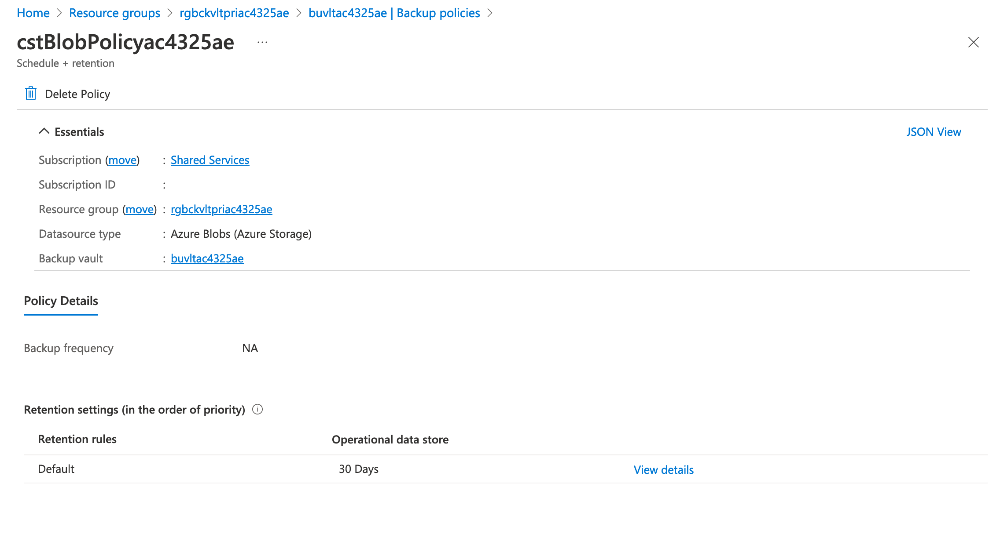

## Exercise 2 - Azure Backup Policies

In this exercise you will explore the [backup policies](https://learn.microsoft.com/en-us/azure/backup/azure-backup-glossary#backup-rule--backup-policy) used by the Azure Backup service to control the frequency and retention of backups. Both Recovery Services Vaults and Backup Vaults use backup policies.

Open the Azure Portal and select the resource group that begins with rgbckvltpri. This resource group contains the Recovery Services Vault and Backup Vault used in the lab. Select the Recovery Services Vault which will begin with vlt. Once within the blade for the Recovery Services Vault, select the Backup policies menu item seen in the screenshot below.

Backup policies for virtual machines are either [standard (sometimes referred to as basic) policies](https://learn.microsoft.com/en-us/azure/backup/backup-azure-arm-vms-prepare) or [enhanced policies](https://learn.microsoft.com/en-us/azure/backup/backup-azure-vms-enhanced-policy). Standard policies are capable of creating one backup a day and retaining restore points for up to 5 days, while enhanced policies can create multiple backups a day (taking multiple backups a day is in public preview as of 1/2023) and retain restore points for up to 30 days. 

The Recovery Service Vault in this lab is created with three backup policies. The policy beginning with cstBscVmPolicy configures protected items assigned this policy to backup once a day at midnight based on Eastern Standard Time. Restore Points are retained for 5 days in the operational tier to allow for instant restore. Daily backups stored in the standard/vault tier are retained for 7 days, weekly backups for 12 weeks, monthly backups for 12 months, and yearly backups for 3 years. This policy is associated with the Linux VM named vml-pri-1-cf.

There are two options not pictured in the screenshot below. The first is to automatically send backups in the standard/vault tier to the [archive tier](https://learn.microsoft.com/en-us/azure/backup/archive-tier-support). The other option configures the policy to use a custom resource group to store restore point collections. By default, the service will create a resource group with a generic name to store restore point collections.

The backup policy beginning with cstAdvVmPolicy is an example of an enhanced policy. The policy is configured to create a backup every 4 hours starting at midnight and creating these backups for all 24 hours of the day. This effectively creates 6 restore points a day. Restore Points are retained for 5 days in the operational tier to allow for instant restore. Daily backups stored in the standard/vault tier are retained for 7 days, weekly backups for 12 weeks, monthly backups for 12 months, and yearly backups for 3 years. This policy is associated with the Windows VM named vmw-pri-1-cf.

The third backup policy beginning with cstFilePolicy is an example of a backup policy for Azure Files. Each resource type that can be backed up to a Recovery Services Vault or Backup Vault has its own schema for the backup policy. This policy is configured to backup the Azure Files share every 4 hours starting at midnight and creating these backs for 23 hours of the day (for some reason it does not allow for 24). Daily backups stored in the standard/vault tier are retained for 7 days, weekly backups for 12 weeks, monthly backups for 12 months, and yearly backups for 3 years.

With Azure File shares snapshots are created of the share using the [snapshot feature of Azure Files](https://learn.microsoft.com/en-us/azure/storage/files/storage-snapshots-files). You have the option of restoring the entire share or individual files. Metadata about the backup is stored in the Recovery Services Vault, not the snapshots themselves. These are stored with the storage account the file share lives in. 

Backup Vaults also use backup policies. Open the Azure Portal and select the resource group that begins with rgbckvltpri. Select the Backup Vault which will begin with buvlt. Once within the blade for the Backup Vault, select the Backup policies menu item seen in the screenshot below.

Take note that when using a Backup Vault filters are enabled to filter to specific types of resources. In the Backup Policies blade, you will need to set the Datasource to the appropriate resource to see policies and resources that are being backed up.

The Backup Vault in this lab is created with two custom policies. One policy is created for Azure Disks and one for Azure Blobs. 

The policy for Azure Disks begins with cstDiskPolicy. This policy is configured to backup the managed disk every hour. The first backup taken each week is retained for 7 days. The weekly backup is retained for 12 weeks. 

A virtual machine backed up through Recovery Services Vault backups up the entire machine and all of the disks attached to it. Azure Disk backup is useful when you need more frequent backups of a specific managed disk, such as a data disk. 

The second policy in the Backup Vault is for Azure Blobs stored in an Azure Storage Account. This policy's name begins with cstBlobPolicy. It is configured to retain backups for 30 days. Notice that within the policy the backup frequency is set to non-applicable. This is because the [blob versioning](https://learn.microsoft.com/en-us/azure/storage/blobs/versioning-overview) feature of Azure Storage is enabled on the Azure Storage account by the backup. This feature automatically retains previous versions of the blob.

Like the Azure Disks backup feature, the Azure Blob backup feature does not transfer data to the Backup Vault. The prior blob versions are retained within the same Azure Storage Account. If you'd prefer to have the blobs stored in another Azure Storage Account in a different resource group or subscription, you should look at [object replication](https://learn.microsoft.com/en-us/azure/storage/blobs/object-replication-overview) instead.

This completes exercise 2. You can now proceed to [exercise 3](/exercises/exercise3.md).