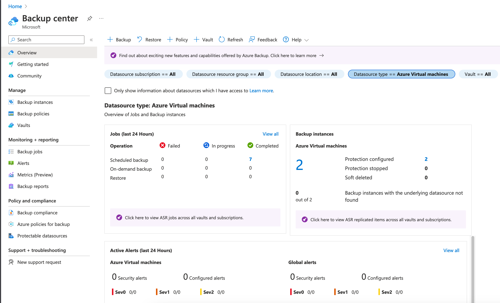
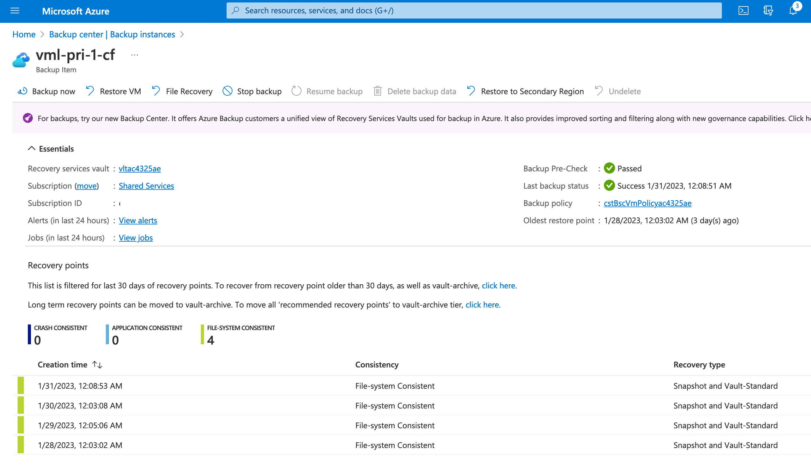
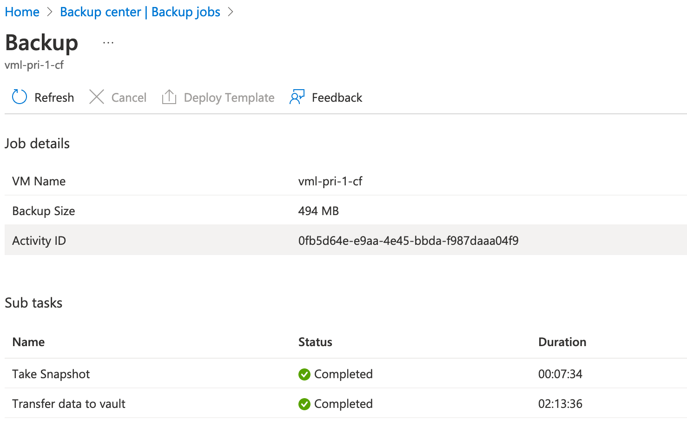
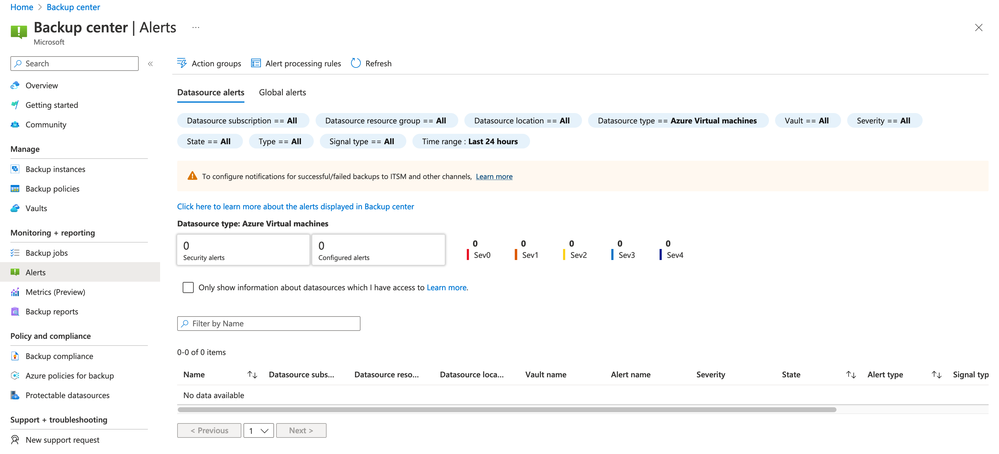
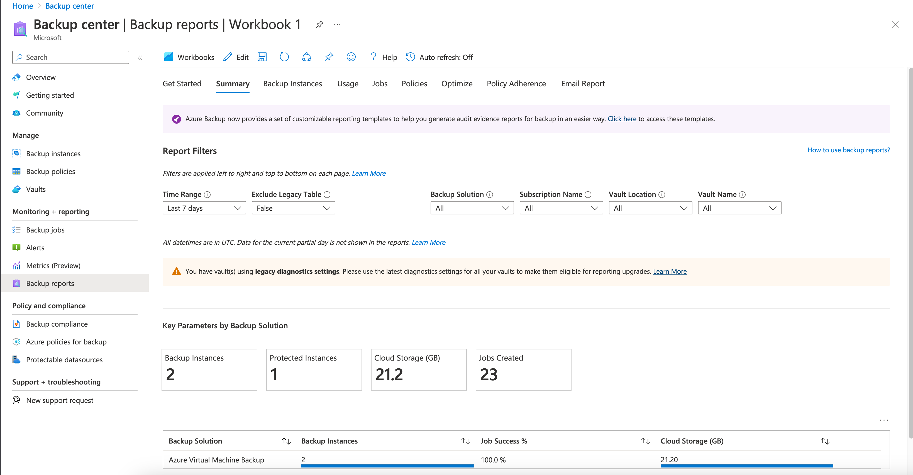
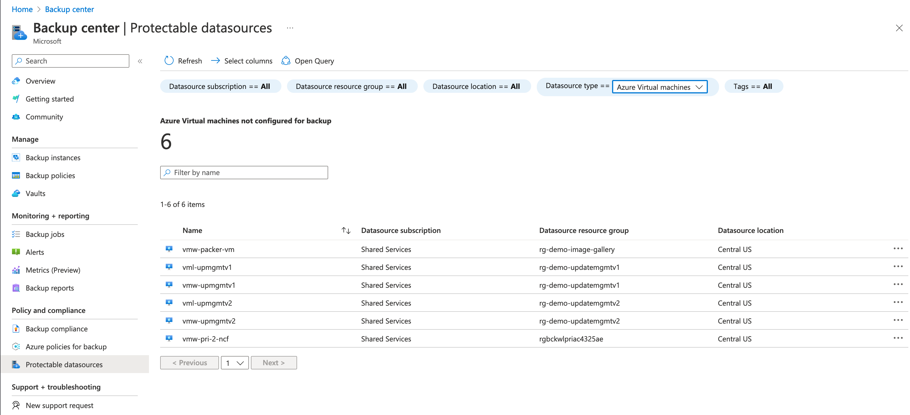

## Exercise 3 - Azure Backup Center

In this exercise you will open the Azure Portal and explore the Azure Backup Center. 

While you could maintain your backups by interacting with the Recovery Services Vaults and Backup Vaults individually, that methodology breaks down at scale. [Azure Backup Center](https://learn.microsoft.com/en-us/azure/backup/backup-center-overview) provides a central location to administer all of the Recovery Services Vaults and Backup Vaults across subscriptions associated with the Azure AD tenant.

Open the Azure Portal and use the search bar to find and access the Backup Center blade. Once the blade opens, a summary of the state of backups configured across the platform is presented. Simliar to the Backup Vault, the overview provides is filtered by datasource type. In the screenshot below, the datasource type is set to Azure Virtual Machines.

Selecting the Backup instances menu item under the Manage section displays all of the resources of the filtered datasource type that are being backed up. In the screenshot below, the two virtual machines configured for backup are displayed along with the vault the machine is configured to backup to and the latest restore point available.

Selecting a specific virtual machine displays a detailed status of the backups for the virtual machine. In the screenshot below, the vml-pri-1-cf virtual machine is shown. The status of the prior backup, associated Backup Policy, and restore points are listed as well as the storage tier each backup is in. Operations such as the creation of an on-demand backup, restore of the VM, [recovering a specific file](https://learn.microsoft.com/en-us/azure/backup/tutorial-restore-files), or even restoring the virtual machine to another region via the [cross-region restore feature](https://azure.microsoft.com/en-us/blog/cross-region-restore-crr-for-azure-virtual-machines-using-azure-backup/).

Note how the restore points for this machine are file-system consistent (often referred to as crash consistent). While Azure Backup can perform application-consistent backups, Linux machines require a [framework (collection of scripts)](https://learn.microsoft.com/en-us/azure/backup/backup-azure-linux-app-consistent) be implemented to support this. Windows machines do not require this extra configuration and application-consistent backups are provided by default.

Selecting the Backup Policies menu item under Manage displays all of the Backup Policies across the both Recovery Services Vaults and Backup Vaults across all subscriptions in the tenant. The Vaults menu item does the same to display all of the Recovery Services Vaults and Backup Vaults.

The Backup jobs menu item under Monitoring and Reporting displays the status of the backup jobs performed by the service. You can select a specific backup job to get useful information such as information on failed backups or the duration of successful backups.

The Alerts menu item under Monitoring and Reporting. This section of Backup Center will display [Azure Monitor alerts](https://learn.microsoft.com/en-us/azure/backup/backup-azure-monitoring-built-in-monitor?tabs=recovery-services-vaults#azure-monitor-alerts-for-azure-backup) and [metric alerts](https://learn.microsoft.com/en-us/azure/backup/metrics-overview) for Azure Backup. These alerts include security alerts such as the deletion of data or a failed backup job. Setting up the alerting is beyond the scope of these exercises, but is [outlined in detail within the public documentation](https://learn.microsoft.com/en-us/azure/backup/backup-azure-monitoring-built-in-monitor?tabs=recovery-services-vaults#azure-monitor-alerts-for-azure-backup).

The Backup Reports menu item provides an [Azure Workbook](https://learn.microsoft.com/en-us/azure/azure-monitor/visualize/workbooks-overview) that can be used to monitor the the state of backups across the customer's Azure platform such as information on the data amount of space used for backups.

Under the Policy and Compliance sections, compliance with custom or [built-in policies for Azure Backup](https://learn.microsoft.com/en-us/azure/backup/policy-reference) applied to a scope containing the resource group can be viewed. Additionally, a summary of resources not configured for backup can be displayed using the Protectable datasources menu item.

This completes exercise 3. You can now proceed to [exercise 4](/exercises/exercise4.md).