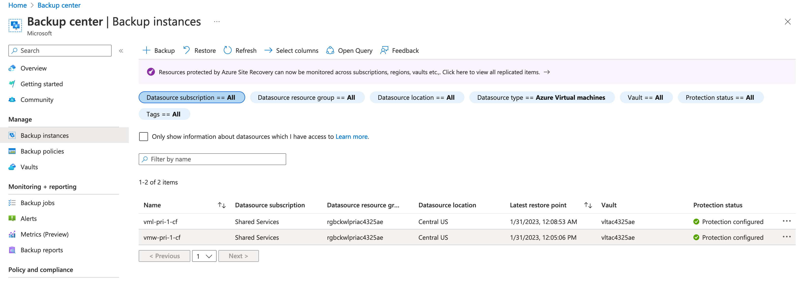
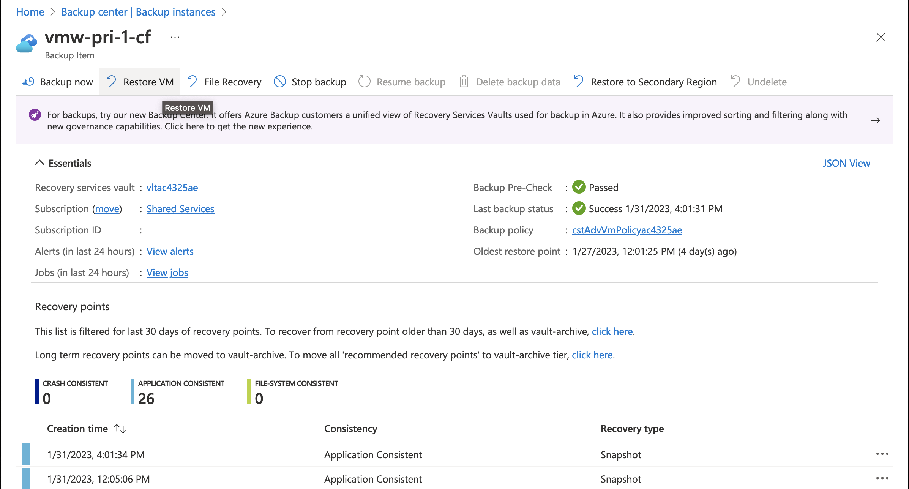
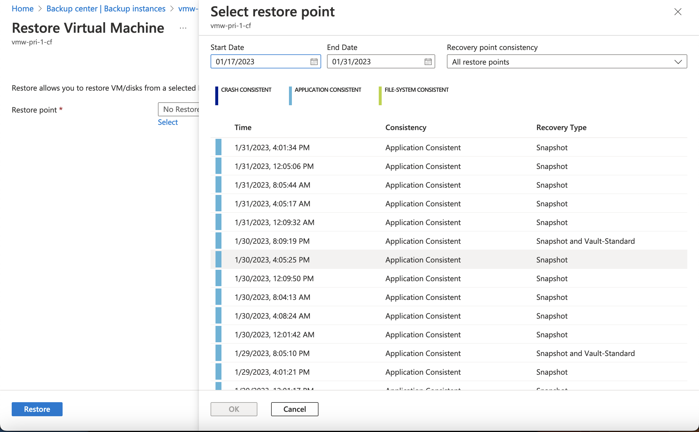
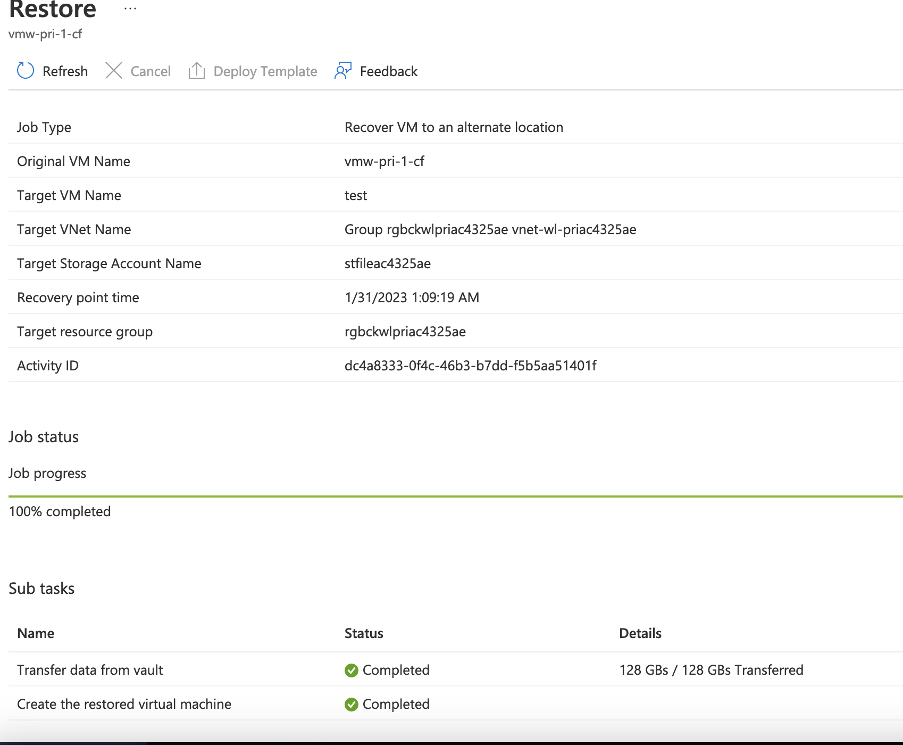

## Exercise 4 - Restoring a Virtual Machine with Azure Backup Center

In this exercise you will restore a virtual machine using Azure Backup Center.

When restoring a virtual machine using Azure Backup a new machine can be created from the restore point, a managed disk can be restored which can then be attached to a virtual machine, or existing managed disks can be replaced on the virtual machine. In this exercise you will create a new machine from a restore point.

Open the Azure Portal and use the search bar to find and access the Backup Center blade. Once the blade opens navigate to the Backup instances menu item under the Manage section. Select the machine named vmw-pri-1-cf.

On backup item screen, select the option to Restore the virtual machine.

On the Restore Virtual Machine screen you are prompted to select a restore point. The consistency and storage tier is included in the description of the restore point. Restore points in the snapshot tier are eligible for instant restore for a quick restore while vault-standard are stored within the vault and will take longer to restore.

After selecting the restore point you are prompted with how you would like the restore point restored. For this exercise, you will create a new virtual machine from the backup.  

You are then prompted to set the name, subscription, resource group, virtual network, subnet, [staging location](https://learn.microsoft.com/en-us/answers/questions/933909/explain-me-the-concept-of-staging-location), and optionally attaching managed item to the restore virtual machine. Choose the storage account beginning with stfile for the staging location and then select the Restore button.

The status of the restore job can be monitored by navigating to the Backup jobs menu item in the monitoring and reporting seciton. Once complete the virtual machine will be available to access

Once complete, the virtual machine will be available to access.

This completes exercise 4. You can now proceed to [exercise 5](/exercises/exercise5.md).