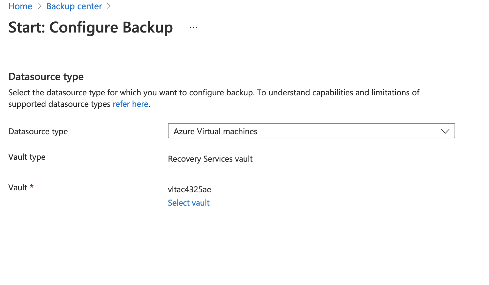
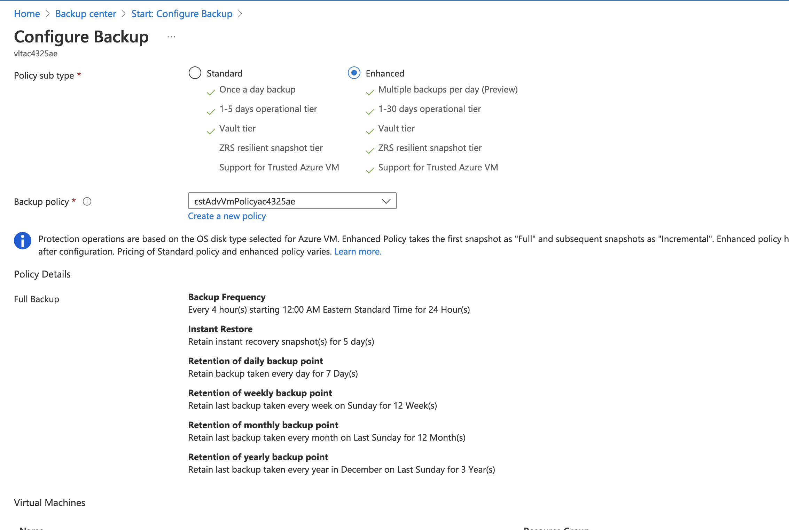
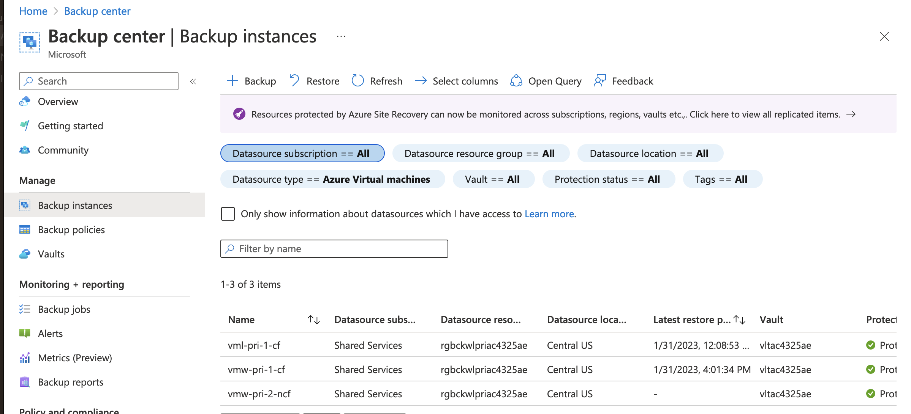

## Exercise 5 - Backup a Virtual Machine with Azure Backup Center

In this exercise you will configure a virtual machine for backup using Azure Backup Center.

Open the Azure Portal and use the search bar to find and access the Backup Center blade. Once the blade opens select the Backup button in the overview section.

On the Start: Configure Backup screen select the Azure Virtual machine as the datasource type and select the Recovery Services Vault with the name beginning with vlt. Select the Continue button.

On the Configure Backup screen you are prompted to select a backup policy. You can filter the policies to either Standard or Enhanced. For this exercise select enhanced policies and choose the policy that begins with cstAdvVmPolicy. You must then add the virtual machine named vmw-pri-2-ncf.

Select the Enable Backup button. This will configure the machine for Azure Backup.

Once the deployment is complete, the machine will be listed as a backup instance in Azure Backup Center.

This completes exercise 5. You can now proceed to [exercise 6](/exercises/exercise6.md).