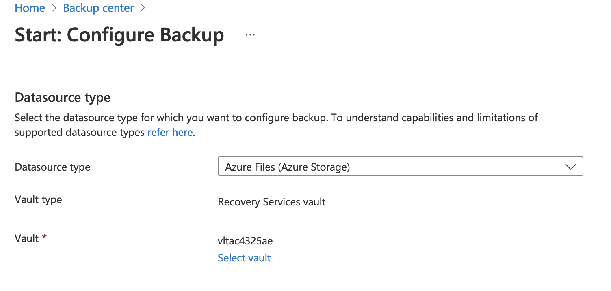
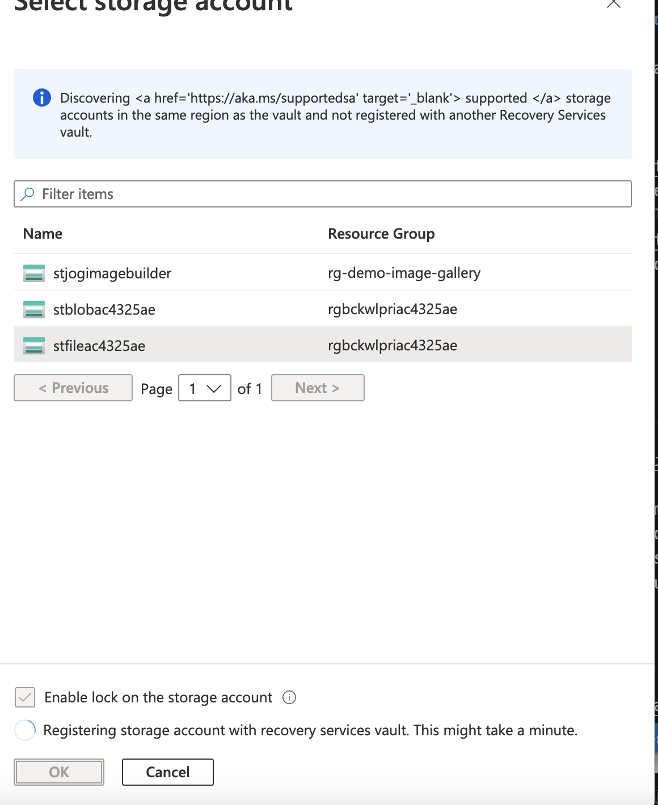
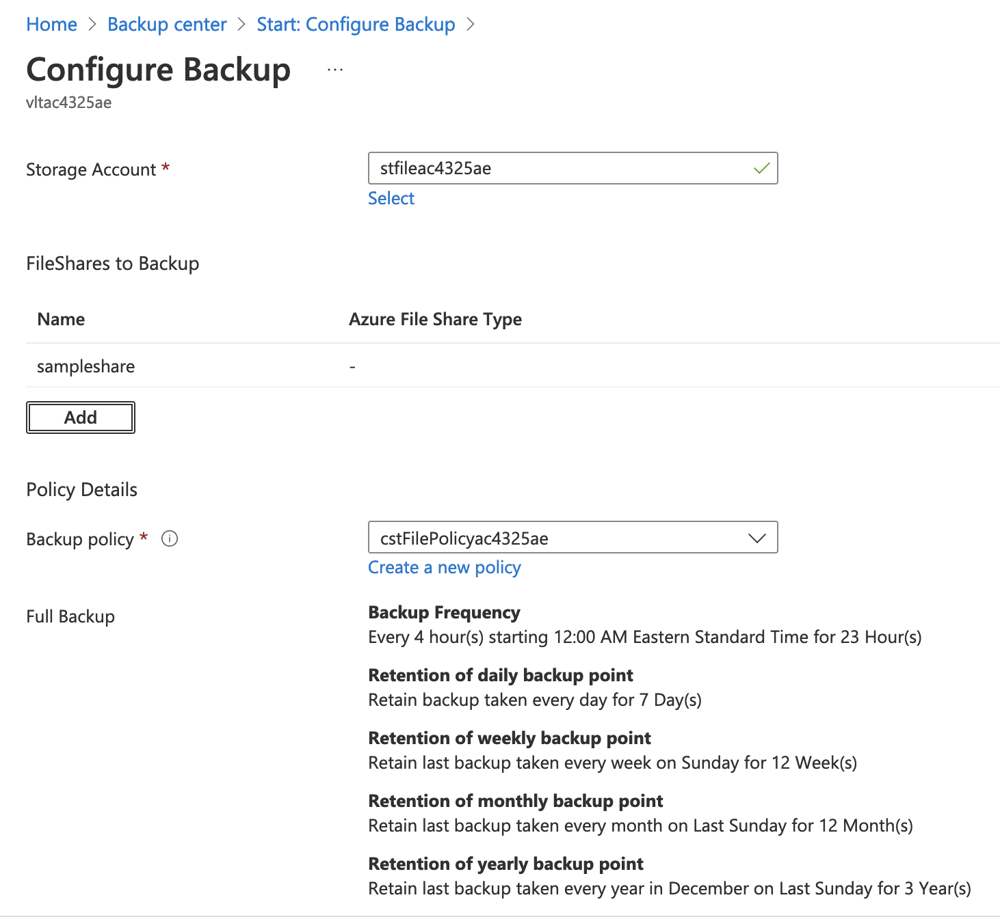
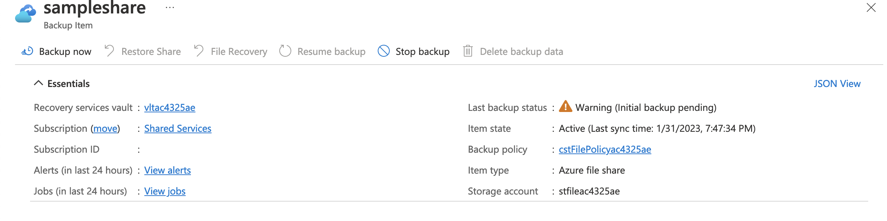
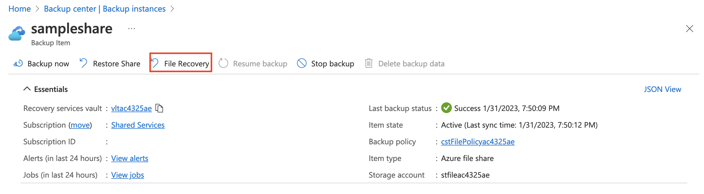
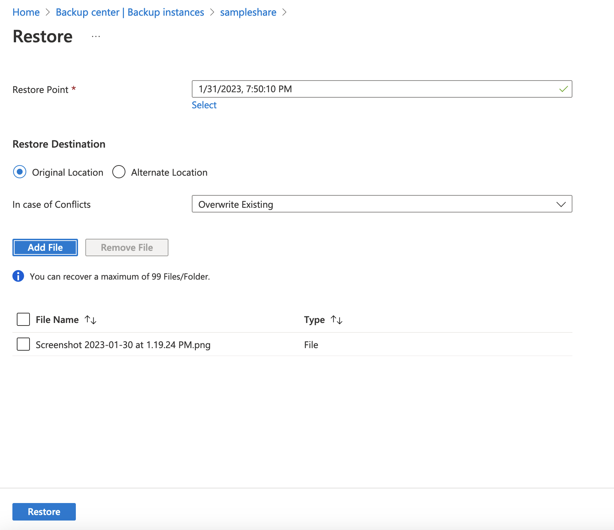

## Exercise 6 - Backup Azure File Share with Azure Backup

In this exercise you will an Azure File share.

Open the Azure Portal and [upload a sample file](https://learn.microsoft.com/en-us/azure/storage/files/storage-how-to-use-files-portal?tabs=azure-portal) to the samplefiles share in the storage account beginning with stfile. 

Once the file is uploaded, open up Azure Backup Center, navigate to the Oveview page and select the Backup option. Select the Azure Files (Azure Storage) as the datasource type and select the Recovery Services Vault with the name beginning with vlt.

On the Configure Backup screen select the Azure Storage account with the name beginning with stfile. The storage account will register with the Recovery Services Vault.

Add the sampleshare file share and select the backup policy with the name beginning with cstFilePolicy. Select the Enable backup button. 

It will take a few minutes to enable the backup.

You will now create an on-demand backup. 

Navigate back to Backup Center when the deployment is complete. Select the Backup instances and choose Azure Files (Azure Storage) as the datasource type. Choose the stfile storage account and select the Backup now option.

The backup will be very quick.

Once the backup is complete, navigate to the file share and delete the sample file that you uploaded and then navigate back to Backup Center.

You will now restore the file you deleted. 

Open the backup instance for the stfile storage account. Notice that you can restore either the entire share or an individual file. Select the option for File Recovery.

Choose the newly created restore point, select the original location, and add the file you wish to restore. Select the Restore button when complete.

The restore will be very quick.

Navigate back to the stfile storage account and open the file share. You will see the file you restored is back.

This completes exercise 6. You can now proceed to [exercise 7](/exercises/exercise7.md).